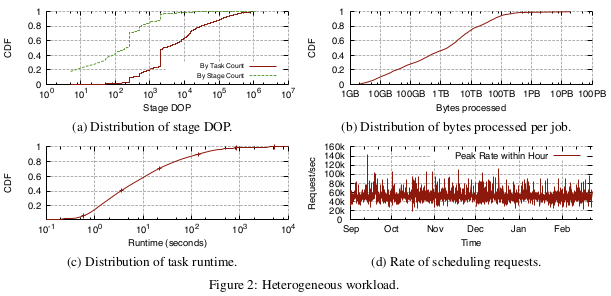
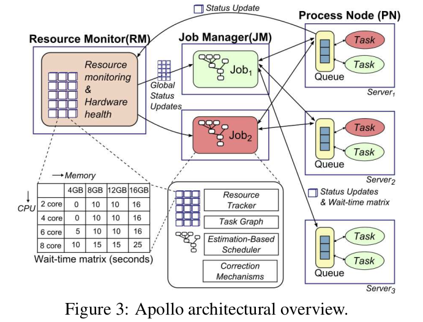
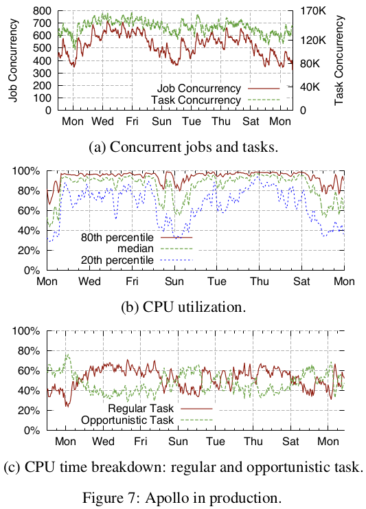

## Apollo
Efficiently scheduling data-parallel computation jobs over cloud-scale computing clusters is critical for job performance, system throughput, and resource utilization. It is becoming even more challenging with growing cluster sizes and more complex workloads with diverse characteristics. Apollo is a highly scalable and coordinated scheduling framework, which  has been deployed on production clusters at Microsoft. The framework performs scheduling decisions in a distributed manner, utilizing global cluster information via a loosely coordinated mechanism.
### Production Workload Characteristics
The characteristics of the target production workloads greatly influence the Apollo design.

+ The computation clusters run more than 1000,000 jobs on a daily basis. At any point in time, there are hundreds of jobs running concurrently.
+ Those vary drastically in almost every dimension, to meet a wide range of business scenarios and requirements.
    + For example, large job process terabytes to petabytes of data, contain sophsticated business logic with a few dozen complex joins, aggregations, and user-defined functions, have hundreds of stages, contain over a million tasks in the execution plan, and may take hours to finish.
    + On the other hand, small jobs process gigabytes fo data and can finish in seconds.
+ The workload diversity poses tremendous challenges for the underlying scheduling framework to deal with efficiently and effectively.
+ Even within a single job, the DOP changes for different stages as the data volume changes over the job's lifetime.
    + Figure 2(a) shows the distribution of stage DOP in the production environment. Almost 40% of stages have a DOP of less than 100, accounting for less than 2% of the total workload. More than 98% of tasks are part of stages with DOP of more than 100.
    + Job sizes vary widely from a single vertex to millions of vertices per job graph. As illustrated in Figure 2(b), the amount of data processed per job ranges from gigabytes to tens of petabytes.
    + Task execution times range from less than 100ms to a few hours, as shown in Figure 2(c). 50% of tasks run for less than 10 seconds and are sensitive to scheduling latency.
    + Collectively, such a large number of jobs create a high scheduling-request rate, with peaks above 1000,000 requests per second, as shown in Figure 2(d).
### Solutions in Apollo
A scheduler must: 
+ scale to make tens of thousands of scheduling decisions per second on a cluster with tens of thousands of servers.
+ maintain fair sharing of resources among different users and groups.
+ make high-quality scheduling decisions that take into account factors such as data locality, job characteristics, and server load, to minimize job latencies while utilizing the resources in a cluster fully.

Apollo's technical contributions:
+ To balance scalability and scheduling quality, Apollo adopts a distributed and coordinated scheduling framework.
+ To achieve high-quality scheduling decisions, Apollo schedules each task on a server that minimizes the task completion time.
+ To supply individual schedulers with cluster information, Apollo introduces a lightweight hardware-independent mechanism to advertise load on servers.
+ Apollo is made robust through a series of correction mechanisms that dynamically adjust and rectify suboptimal decisions at runtime.
+ To drive high cluster utilization while maintaining low job latencies, Apollo introduces opportunistic scheduling, which effectively creates two classes of tasks: regular tasks and opportunistic tasks.
+ To ensure no service disruption or performance regression when we roll out Apollo to replace a previous scheduler deployed in production, we designed Apollo to support staged rollout to production clusters and validation at scale.

#### The Apollo Framework

Figure 3 provides an overview of Apollo's architecture. 
+ A Job Manager(JM), also called a scheduler, is assigned to manager the life cycle of each job.
+ A Resource Monitor (RM) aggregates load information from PNs across the cluster continuously, providing a global view of the cluster status for each JM to make informed scheduling decisions. 
+ A Process Node (PN) process running on each server is responsible for managing the local resources on that server and performing local scheduling.

Besides, Apollo also invokes many other great methods to solve specified problems. 
+ when the RM is temporarily unavailable, Apollo can continue to make scheduling decisions (at a degraded quality). Once a task is scheduled to a PN, the JM obtains up-to-date load information directly from the PN via frequent status updates.
+ To better predict resource utilization in the near future and to optimize scheduling quality, each PN maintains a local queue of tasks assigned to the server and advertises its future resource availability in the form of a wait-time matrix inferred from the queue.
    + A queue of tasks assigned to the server, was maanged by the PN on each server, in order to provide projections on future resource availability. The queue is mostly FIFO, but can be reordered.
    + A wait-time matrix, with each cell corresponding to the expected wait time for a task that requires a certain amount of CPU and memory.
+ Cluster dynamics pose many challenges in practice; for example, the wait-time matrices might be stale, estimates might be suboptimal, and the cluster environment might sometimes be unpredictable. Apollo therefore incorporates correction mechanisms for robustness and dynamically adjusts scheduling decisions at runtime.

#### Estimation-Based Scheduling
A JM has to decide which server to schedule a particular task to using the wait-time matrices in the aggregated view provided by the RM and the individual characteristics of the task to be scheduled.

Apollo considers various factors holistically and performs scheduling by estimating task completion time.
+ First, the task completion time if there is no failure, denoted by Esucc, using the formula Esucc = I +W + R. 
    + I denotes the initialization time for fetching the needed files for the task, which could be 0 if those files are cached locally. 
    + The expected wait time, denoted as W, comes from a lookup in the wait-time matrix of the target server with the task resource requirement. 
    + The task runtime, denoted as R, consists of both I/O time and CPU time.
+ Second, the probability of task failure to calculate the final completion time estimate, denoted by C. C = Psucc * Esucc + Kfail * (1 − Psucc) * Esucc.
    + A success probability Psucc is derived and considered to calculate C.
    + Kfail, a penalty constant determined empirically, is used to model the cost of server failure on the completion time.

##### Task priority
+ Each task is assigned to be a regular task or an opportunistic task according to whether it has a token. An opportunistic task can be upgraded to a regular task when assigned a token.
+ To improve to utilizations of servers, tasks are allowed to execute in the opportunistic mode, without allocated resources. 
+ Performance degradation of regular task is prevented by running opportunistic tasks at a lower priority at each server, and any opportunistic task can be preempted or terminated if the server is under resource pressure.
##### Stable Matching
For efficiency, Apollo schedules tasks with similar priorities in batches and turns the problem of task scheduling into that of matching between tasks and servers.
+ Apollo limits the search space for a task to a candidate set of servers.
+ Apollo adopts a variant of the stable matching algorithm to match tasks with servers. For each task in a batch, Apollo finds the server with the earliest estimated completion time as a proposal for that task.
+ To simplify the matching algorithm for a tradeoff between efficiency and quality, Apollo assigns only one task to each server in a single batch.
#### Correction Mechanisms
+ Duplicate Scheduling. When a JM gets fresh information from a PN during task creation, task upgrade, or while monitoring its queued tasks, the scheduler re-evaluates the decision if 
    + (i) the updated expected wait time is significantly higher than the original;
    + (ii) the expected wait time is greater than the average among the tasks in the same stage;
    + (iii) the elapsed wait time is already greater than the average.
    Duplicates are discarded when one task starts.
+ Randomization. Apollo adds asmall random number to each completion time estimation to reduce the chances of conflicts.
+ Confidence. When the confidence in the wait-time matrix is low, the scheduler will produce a pessimistic estimate by looking up the wait time of a task consuming more CPU and memory.
+ Straggler Detection. When the time it would take to rerun a task is significantly less than the time it would take to let it complete, a duplicate copy is started. They will execute in parallel until some one finishes.
### Concrete Performance with Apollo
#### Apollo at Scale

Apollo is highly scalable, capable of scheduling over 20,000 requests per second, and driving high and balanced system utilization while incurring minimum syqueuing time.
+ Apollo can constantly provide a scheduling rate of above 10,000, reaching up to 20,000 per second in a single cluster.
+ Figure 7(a) shows the number of concurrently running jobs and their tasks in the cluster while Figure 7(b) shows server CPU utilization in the same period, both sampled at every 10 seconds. Apollo is able to run 750 concurrent complex jobs (140,000 concurrent regular tasks) and achieve over 90% CPU utilization when the demand is high during the weekdays, reaching closely the capacity of the cluster.
#### Scheduling Quality
Apollo delivers excellent job performance compared with the baseline scheduler and its scheduling quality is close to the optimal case.
+ About 40% of the production jobs in the cluster has a recurring pattern and such recurring jobs account for more than 75% system resource utilization.
+ About 80% of recurring jobs receive various degrees of performance improvements (up to 3x in speedup) with Apollo.
+ On average, the job latency improved around 22% with Apollo over the baseline scheduler, and Apollo performed within 4.5% of the oracle scheduler.
#### Evaluating Estimates
Apollo provides good estimates on task wait time and CPU time, despite all the challenges, and estimation does help improve scheduling quality.
+ Over 95% tasks have a wait time estimation error of less than 1 second.
+ For 75% of tasks, the CPU time predicted when the task is scheduled is within 25% of the actual CPU consumption.
#### Correction Effectiveness
Apollo’s correction mechanisms are shown effective with small overhead.
+ Overall, Apollo’s duplicate scheduling is efficient, with 82% success rates, and accounts for less than 0.5% of task creations.
+ Apollo is able to catch more than 70% stragglers efficiently and apply mitigation timely to expedite query execution.
#### Stable Matching Efficiency
Apollo’s matching algorithm has the same asymptotic complexity as a naive greedy algorithm with negligible overhead. It performs significantly better than the greedy algorithm and is within 5% of the optimal scheduling in our simulation.
+ In our case the complexity of the stable matching algorithm is limited to O(n log(n)).
+ The algorithm usually converges in less than 3 iterations and our implementation limits the number of iterations of the matcher, which makes the worst case complexity O(n log(n)), the same as the greedy algorithm.
+ the stable matching algorithm performs within 5% of the optimal matching under the simulated conditions while the greedy approach was 57% slower than the optimal matching.
### New Problems and Thoughts
waste-time matrix的更新速率过快，难以及时更新到JM上。提高更新的速率会提高JM调度的准确性，但是数据的传输可能成为性能瓶颈；如果采用较低的更新速率，则JM调度的结果就会没有那么准确，即可能是suboptimal的方案。这就形成了一个tradeoff。
## Reference
[Apollo: Scalable and Coordinated Scheduling
for Cloud-Scale Computing](./Apollo.pdf)