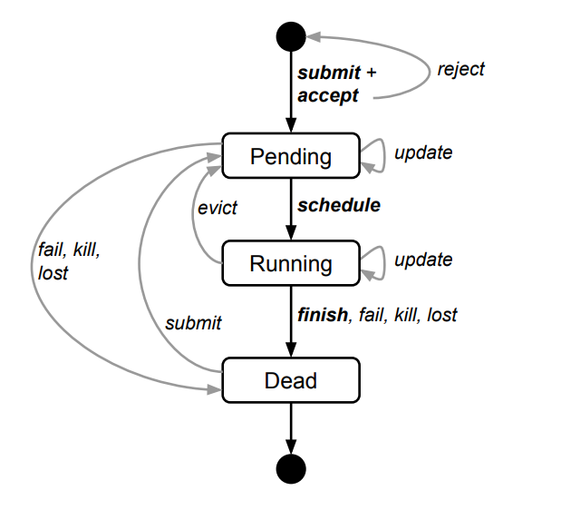
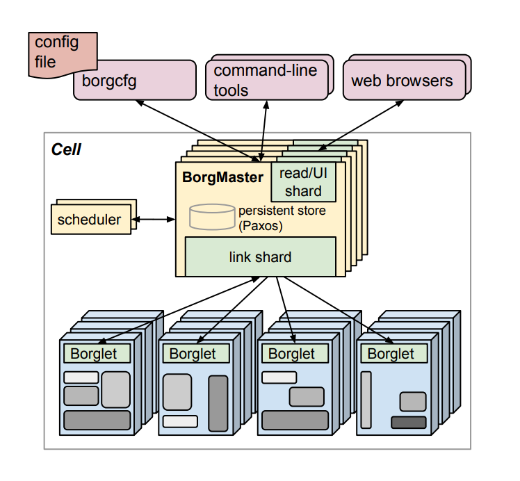
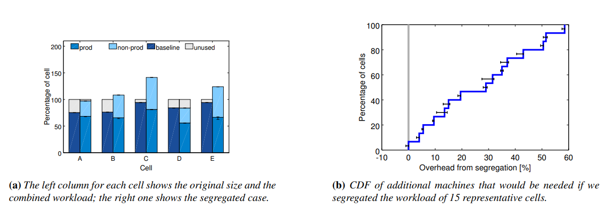
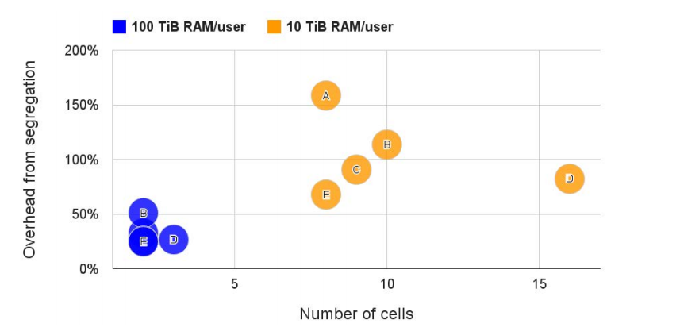
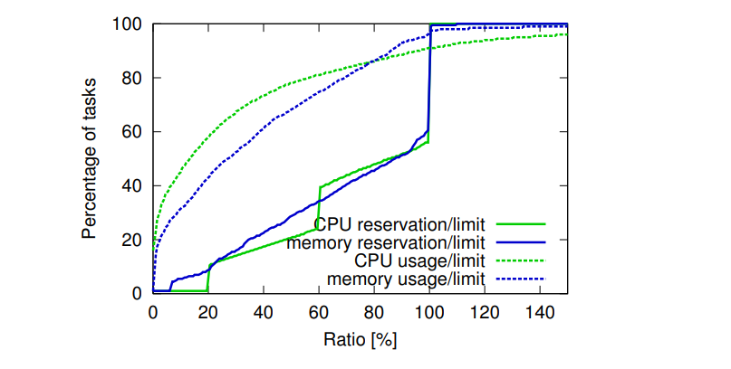
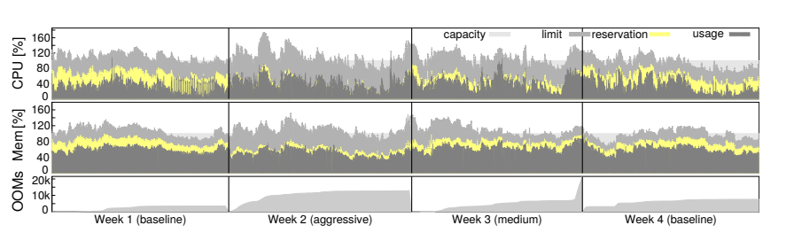

# Borg

Google’s Borg system is a cluster manager that runs hundreds of thousands of jobs, from many thousands of different applications, across a number of clusters each with up to tens of thousands of machines.

## Introduction

The cluster management system we internally call Borg admits, schedules, starts, restarts, and monitors the full range of applications that Google runs. 

Borg provides three main benefits:
1. hides the details of resource management and failure handling so its users can focus on application development instead
2. operates with very high reliability and availability, and supports applications that do the same
3.  lets us run workloads across tens of thousands of machines effectively

## What problem does it solve

To improve the resource utilization of clusters in certain workload.

## Solutions in Borg

---

####  Some thing

Some words in Borg.

#####  Clusters and cells

The machines in a cell belong to a single cluster, defined by the high-performance datacenter-scale network fabric that connects them. A cluster lives inside a single datacenter building, and a collection of buildings makes up a site.1 A cluster usually hosts one large cell and may have a few smaller-scale test or special-purpose cells.

##### Jobs and tasks

A Borg job’s properties include its name, owner, and the number of tasks it has. Each task maps to a set of Linux processes running in a container on a machine. A task has properties too, such as its resource requirements and the task’s index within the job. Users operate on jobs by issuing remote procedure calls (RPCs) to Borg. 

#####  Allocs

A Borg alloc (short for allocation) is a reserved set of resources on a machine in which one or more tasks can be run; the resources remain assigned whether or not they are used.

##### Priority, quota, and admission control

Every job has a priority, a small positive integer. A highpriority task can obtain resources at the expense of a lowerpriority one, even if that involves preempting (killing) the latter. 

Quota is used to decide which jobs to admit for scheduling. Quota is expressed as a vector of resource quantities (CPU, RAM, disk, etc.) at a given priority, for a period of time (typically months).

#####  Naming and monitoring

Borg creates a stable “Borg name service” (BNS) name for each task that includes the cell name, job name, and task number.

Almost every task run under Borg contains a built-in HTTP server that publishes information about the health of the task and thousands of performance metrics (e.g., RPC latencies). 

#### Borg architecture

A Borg cell consists of a set of machines, a logically centralized controller called the Borgmaster, and an agent process called the Borglet that runs on each machine in a cell.

##### Borgmaster

The main Borgmaster process handles client RPCs that either mutate state (e.g., create job) or provide read-only access to data (e.g., lookup job). It also manages state machines for all of the objects in the system (machines, tasks, allocs, etc.), communicates with the Borglets, and offers a web UI as a backup to Sigma.

* Replicate five times
* Checkpoint
* A high-fidelity Borgmaster simulator called Fauxmaster (for test)

##### Scheduling

When a job is submitted, the Borgmaster records it persistently in the Paxos store and adds the job’s tasks to the pending queue. This is scanned asynchronously by the scheduler, which assigns tasks to machines if there are sufficient available resources that meet the job’s constraints. (The scheduler primarily operates on tasks, not jobs.) The scan proceeds from high to low priority, modulated by a round-robin scheme within a priority to ensure fairness across users and avoid head-of-line blocking behind a large job.

* feasibility checking
* scoring

Distribution strategy:

* spreading load across all the machines, leaving headroom for load spikes
* fill machines as tightly as possible
* a hybrid one that tries to reduce the amount of stranded resources

#####  Borglet

The Borglet is a local Borg agent that is present on every machine in a cell.

* starts and stops tasks
* restarts them if they fail
* manages local resources by manipulating OS kernel settings
* rolls over debug logs
* reports the state of the machine to the Borgmaster and other monitoring systems

##### Scalability

* Score caching
* Equivalence classes
* Relaxed randomization

#### Availability

* automatically reschedules evicted tasks, on a new machine if necessary
* reduces correlated failures by spreading tasks of a job across failure domains such as machines, racks, and power domains
* limits the allowed rate of task disruptions and the number of tasks from a job that can be simultaneously down during maintenance activities such as OS or machine upgrades
* uses declarative desired-state representations and idempotent mutating operations, so that a failed client can harmlessly resubmit any forgotten requests
* rate-limits finding new places for tasks from machines that become unreachable, because it cannot distinguish between large-scale machine failure and a network partition
* avoids repeating task::machine pairings that cause task or machine crashes
* recovers critical intermediate data written to local disk by repeatedly re-running a logsaver task (§2.4), even if the alloc it was attached to is terminated or moved to another machine. Users can set how long the system keeps trying; a few days is common

#### Utilization

> **cell compaction**: given a workload, we found out how small a cell it could be fitted into by removing machines until the workload no longer fitted, repeatedly re-packing the workload from scratch to ensure that we didn’t get hung up on an unlucky configuration. 
> 
> Use Fauxmaster to obtain high-fidelity simulation results, using data from real production cells and workloads, including all their constraints, actual limits, reservations, and usage data (§5.5).

##### Cell sharing

Segregat prod and non-prod work would need 20–30% more machines in the median cell to run our workload.

Split off a user’s workload into a new cell if they consumed at least 10 TiB of memory (or 100 TiB).

Sharing doesn’t drastically increase the cost of running programs

##### Large cells

Google builds large cells, both to allow large computations to be run, and to decrease resource fragmentation.

#####  Fine-grained resource requests

Borg users request CPU in units of milli-cores, and memory and disk space in bytes. 

##### Resource reclamation

A job can specify a resource **limit** – an upper bound on the resources that each task should be granted. some tasks occasionally need to use all their resources (e.g., at peak times of day or while coping with a denial-of-service attack), but most of the time do not. 

Rather than waste allocated resources that are not currently being consumed, we estimate how many resources a task will use and reclaim the rest for work that can tolerate lower-quality resources, such as batch jobs. This whole process is called resource reclamation. The estimate is called the task’s **reservation**, and is computed by the Borgmaster every few seconds, using fine-grained usage (resourceconsumption) information captured by the Borglet. 

The Borg scheduler uses limits to calculate feasibility (§3.2) for prod tasks,4 so they never rely on reclaimed resources and aren’t exposed to resource oversubscription; for non-prod tasks, it uses the reservations of existing tasks so the new tasks can be scheduled into reclaimed resources.

A machine may run out of resources at runtime if the reservations (predictions) are wrong – even if all tasks use less than their limits. If this happens, we kill or throttle nonprod tasks, never prod ones.

Figure 11 (above) suggests that resource reclamation may be unnecessarily conservative: there is significant area between the reservation and usage lines. To test this, we picked a live production cell and adjusted the parameters of its resource estimation algorithm to an aggressive setting for a week by reducing the safety margin, and then to an medium setting that was mid-way between the baseline and aggressive settings for the next week and then reverted to the baseline.

Figure 12 (above) shows what happened. Reservations are clearly closer to usage in the second week, and somewhat less so in the third, with the biggest gaps shown in the baseline weeks (1st and 4th). As anticipated, the rate of out-of-memory (OOM) events increased slightly in weeks 2 and 3.5 After reviewing these results, we decided that the net gains outweighed the downsides, and deployed the medium resource reclamation parameters to other cells.

#### Isolation

##### Security isolation

* Linux chroot jail
* Borgssh
* VMs and security sandboxing

##### Performance isolation

* Linux cgroup-based resource **container**
* LS tasks (latency-sensitive) can reserve entire physical CPU cores, which stops other LS tasks from using them. 
* Tasks are permitted to consume resources up to their limit. Most of them are allowed to go beyond that for compressible resources like CPU, to take advantage of unused (slack) resources.

---

## Reference

[Large-scale cluster management at Google with Borg](./Borg.pdf)

