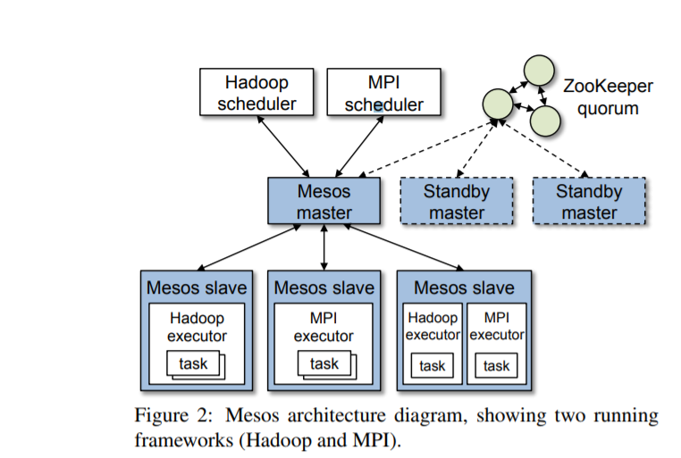
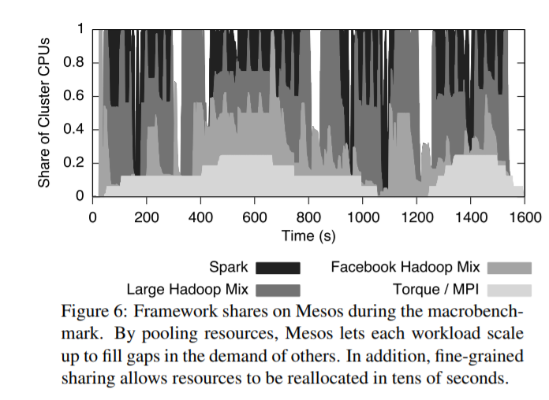
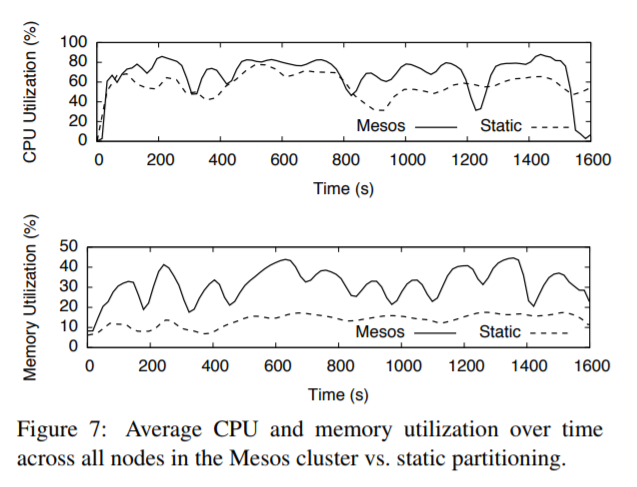

# Mesos

Mesos is a platform  for  sharing  commodity clusters between multiple diverse cluster computing
frameworks, such as Hadoop and MPI.

## Introduction

To support the sophisticated schedulers of today’s frameworks, Mesos introduces a distributed two-level
scheduling mechanism called resource offers. Mesos decides how many resources to offer each framework,
while frameworks decide which resources to accept and which computations to run on them. According to
results of the paper show that Mesos can achieve near-optimal data locality when sharing the cluster
among diverse frameworks, can scale to 50,000 (emulated) nodes, and is resilient to failures.

## What problem does it solve

Many organizations will want to run multiple frameworks in the same cluster, picking the best one for
each application. Multiplexing a cluster between frameworks improves utilization and allows
applications to share access to large datasets that may be too costly to replicate across clusters. In
this paper, authors propose Mesos, a thin resource sharing layer that enables fine-grained sharing
across diverse cluster computing frameworks, by giving frameworks a common interface for accessing
cluster resources.

---

## Solutions in Mesos

### General Idea

Mesos takes a different approach: delegating control over scheduling to the frameworks. This is
accomplished through a new abstraction, called a resource offer, which encapsulates a bundle of
resources that a framework can allocate on a cluster node to run tasks. Mesos decides how many resources
to offer each framework, based on an organizational policy such as fair sharing, while frameworks decide
which resources to accept and which tasks to run on them. While this decentralized scheduling model may
not always lead to globally optimal scheduling, authors have found that it performs surprisingly well in
practice, allowing frameworks to meet goals such as data locality nearly perfectly. In addition,
resource offers are simple and efficient to implement, allowing Mesos to be highly scalable and robust
to failures.

### Design Philosophy

Mesos aims to provide a scalable and resilient core for enabling various frameworks to efficiently share
clusters. Because cluster frameworks are both highly diverse and rapidly evolving, our overriding design
philosophy has been to define a minimal interface that enables efficient resource sharing across
frameworks, and otherwise push control of task scheduling and execution to the frameworks. Pushing
control to the frameworks has two benefits. First, it allows frameworks to implement diverse approaches
to various problems in the cluster (e.g., achieving data locality, dealing with faults), and to evolve
these solutions independently. Second, it keeps Mesos simple and minimizes the rate of change required
of the system, which makes it easier to keep Mesos scalable and robust. Although Mesos provides a
low-level interface, authors expect higher-level libraries implementing common functionality (such as
fault tolerance) to be built on top of it. These libraries would be analogous to library OSes in the
exokernel. Putting this functionality in libraries rather than in Mesos allows Mesos to remain small and
flexible, and lets the libraries evolve independently.

### Architecture

The figure  shows the main components of Mesos. Mesos consists of a master process that manages slave
daemons running on each cluster node, and frameworks that run tasks on these slaves.

### Resource Allocation

we have implemented two allocation modules: one that performs fair sharing based on a generalization of
max-min fairness for multiple resources and one that implements strict priorities. Similar policies are
used in Hadoop and Dryad.

### Isolation

Mesos provides performance isolation between framework executors running on the same slave by leveraging
existing OS isolation mechanisms. Since these mechanisms are platform-dependent, authors support
multiple isolation mechanisms through pluggable isolation modules.

### Making Resource Offers Scalable and Robust

#### Filters

Because some frameworks will always reject certain resources, Mesos lets them short-circuit the
rejection process and avoid communication by providing filters to the master. authors currently support
two types of filters: “only offer nodes from list L” and “only offer nodes with at least R resources
free”.

#### Responce

Because a framework may take time to respond to an offer, Mesos counts resources offered to a framework
towards its allocation of the cluster. This is a strong incentive for frameworks to respond to offers
quickly and to filter resources that they cannot use.

#### Re-offers

If a framework has not responded to an offer for a sufficiently long time, Mesos rescinds the offer and
re-offers the resources to other frameworks.

### Fault Tolerance

#### Master failures

we have designed the master to be soft state, so that a new master can completely reconstruct its
internal state from information held by the slaves and the framework schedulers. In particular, the
master’s only state is the list of active slaves, active frameworks, and running tasks. This information
is sufficient to compute how many resources each framework is using and run the allocation policy.
Authors run multiple masters in a hot-standby configuration using ZooKeeper for leader election. When
the active master fails, the slaves and schedulers connect to the next elected master and repopulate its
state.

#### node failures

Aside from handling master failures, Mesos reports node failures and executor crashes to frameworks’
schedulers. Frameworks can then react to these failures using the policies of their choice. Finally, to
deal with scheduler failures, Mesos allows a framework to register multiple schedulers such that when
one fails, another one is notified by the Mesos master to take over. Frameworks must use their own
mechanisms to share state between their schedulers.

---

## Behavior

### Macrobenchmark

A successful result for Mesos would show two things:that Mesos achieves higher utilization than static
partitioning, and that jobs finish at least as fast in the shared cluster as they do in their static
partition, and possibly faster due to gaps in the demand of other frameworks.

Authors show the fraction of CPU cores allocated to each framework by Mesos over time in Figure 1.
Authors see that Mesos enables each framework to scale up during periods when other frameworks have low
demands, and thus keeps cluster nodes busier. For example, at time 350,when both Spark and the Facebook
Hadoop framework have no running jobs and Torque is using 1/8 of the cluster, the large-job Hadoop
framework scales up to 7/8 of the cluster. In addition, authors see that resources are reallocated
rapidly (e.g., when a Facebook Hadoop job starts around time 360) due to the fine-grained nature of
tasks. Finally, higher allocation of nodes also translates into increased CPU and memory utilization (by
10% for CPU and 17% for memory), as shown in Figure 6.

---

## New Problems and Thoughts

Nonetheless, we believe that below any hint system, frameworks should still have the ability to reject
offers and to choose which tasks to launch on each resource, so that their evolution is not constrained
by the hint language provided by the system.

## Reference

[Mesos: A Platform for Fine-Grained Resource Sharing in the Data Center](./mesos.pdf)
